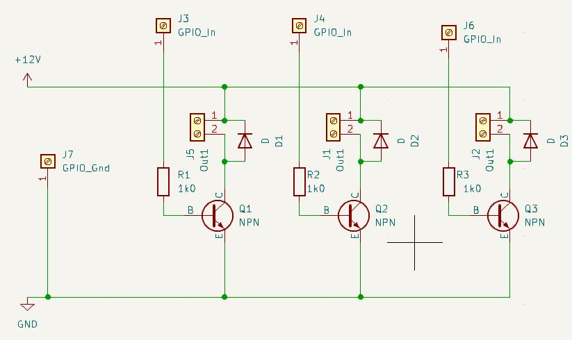
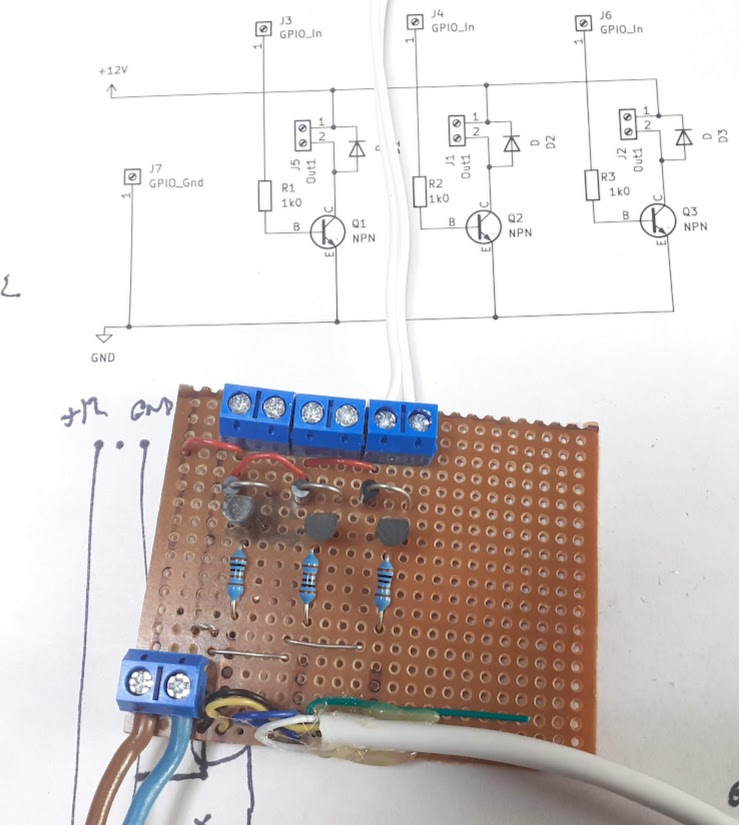

CatoCam & CatoZap - monitor a cctv camera to detect cats (CatoCam), and unleash a suitable cat deterrent (CatoZap).

Purpose
=======
The purpose of CatoCam/CatoZap is to deter cats from regarding our garden as their territory humanely.   We do not appreciate what they leave behind!

Project Outline
===============
There are two distinct parts to the project - CatoCam and CatoZap

Catocam monitors the video stream from a [Tp-Link tapo](https://www.tp-link.com/uk/home-networking/cloud-camera/tapo-c510w/) cctv camera by connecting to its local network rtsp stream to grab frames.  
 

It uses a machine learning object detection model [YoloV8](https://yolov8.com) to determine whether the frame contains an image of a cat or not.

It provides a web interface which can be monitored to see when a cat is detected.

When CatoCam detects that a cat has loitered in the garden for more than a few seconds, it uses CatoZap to encourage the cat to move on.  CatoZap is a simple interface to allow a raspberry Pi to control small solenoid valves to switch water jects on and off when required.  

I might try extending it to use an ultrasonic deterrent as done in this [similar project](https://medium.com/@james.milward/deterring-foxes-and-badgers-with-tensorflow-lite-python-raspberry-pi-ring-cameras-ultrasonic-75b3160faa3c).

CatoCam Structure
=================
  - Connect to the camera rtsp stream using the [framegrab](https://pypi.org/project/framegrab/) library
  - Grab a frame
  - Detect cats in the frame using a custom trained [YoloV8](https://yolov8.com) model (see below).
  - Save annotated frames that contain detected cats, birds or humans to disk for future analysis
  - Provide a simple web interface using the [Flask](https://pypi.org/project/Flask/) framework, which has the following functions:
      - View current image on web browser.
      - Browse through previous images where cats, birds or humans were detected.
      - Provide a simple status JSON object with detection status that can be monitored by CatoZap
  - It is configured using a simple JSON config.json file that specifies the camera parameters to access the video stream, and the object detection model to be used (see the example [config.json template](./config_template.json))
  - If it detects a cat in two frames within 15 seconds of each other, it treats this as a 'cat event', which lasts until no cat is detected for 30 seconds.
  - During a cat event, it calls on CatoZap to fire its water jets to encourage the cat to move along.
  - When the cat event finishes, it concatenates all of the image frames that have been collected during the event into a single movie file and saves it to disk.

  Catocam is running on a Raspberry Pi 4B, 2GB memory and achieving 0.6 frames per second.  I am hoping to improve this by using a quantized version of the yolov8n model.

  An example output is shown below:
  

Training the YoloV8 Model
=========================
If found that pre-trained object detection models were giving poor performance on my cctv images, probably for two reasons:
  1. The camera angle is looking down on the  scene, which is not the case for most image libraries.
  2. The images are often taken under infrared illumination so are grey scale not colour

For this reason I modified the YoloV8 model by training it on my own models.   This required the following:
  - Set up the camera and have it monitor the garden, recording video clips when motion was detected.
  - View the video clips to identify which ones contain cats, and download them (You actually have to download the videos onto a phone as there is no computer interfae to the Tapo camera, only and Android App.  So the process was to view the video on my phone, download it onto my phone, and upload it to Google Photos.  I could then download it onto my computer using the Google Photos web site).
  - Use the [RoboFlow](https://roboflow.com) web site to create an annotated dataset by using its capabilities to:
      - split the video clips into frames
      - view each frame
      - let me draw a bounding box around the interesting objects (cats, birds or humans), and label them as such.
      - Add the images to a dataset, along with augmentation of the objects in the bounding boxes.
      - Publish the [dataset](https://universe.roboflow.com/graham-jones-yynmh/catocam) <a href="https://universe.roboflow.com/graham-jones-yynmh/catocam">
    </img>
</a>
  - The annotation was made less tedious by first doing a few (well a hundred or so) frames manually, then using RoboFlow's training functionality (you get three goes at training a model with a free account), to create an object detection model.   This object detection model can then be used to help you annotate other images by suggesting what the bounding box and object is, so you only have to correct it when it has something wrong.
  - Export the Roboflow dataset in YoloV8 format, and extract it to ~/yolo/datasets/CatoCam.<version number>
  - Create a python virtual environment for catocam: python -m venv /home/graham/pyEnvs/catocam
  - Activate catocam environment with source ~/pyEnvs/catocam/bin/activate
  - Change directory to this catocam source directory.
  - Install dependencies with pip install -r requirements.txt
  - Use the simple [trainYolo.py](./yolo/trainYolo.py) script to train the model using our new dataset.
      - This creates a new set of weights for the yolo model, which we saved as [catFinderV8_yoloWeights.pt](./catFinderV8_yoloWeights.pt) for use by CatoCam.

### Results
The results were surprisingly good - we detected cats very well.   But, it detected pigeons as cats too, and I might not want to shoot the pigeons, so I introduced an extra category 'bird'.  I also found it was detecting people as cats sometimes, so I added a set of images of people and an extra category 'human'.   Having done that we seem to be detecting cats, birds and humans quite well.

Now the camera I am using will track motion to keep the moving object in the field of view.   This does mean that the background can change quite a bit and I found that if it saw the edge of a wall, or a barrel shaped compost bin it was marking this as a human.   This is not too big a deal because I won't be shooting humans, but I'd rather it got it right.  So I added more images of other things it might see in the garden and marked them as null (not a cat, bird or human).   This is now working pretty well, but I do get the occasional 'human' detection for a close up of a cobweb under the IR floodlight, so I'll need to add some cobweb images in too.

I also have the idea of using this with several cameras in different positions around the garden, so I have installed on next to the drive.   Initial results suggest it still detects humans ok, but it sees other shapes like windows and the gate posts as humans - I think it has larned that tall, narrow things are human....  So I have collected a lot more negative images and are currently training those into the model so we can see if it can detect cats in a different setting to the training images - ie to see how generic the model is.   I might see if [James Milward](https://medium.com/@james.milward/deterring-foxes-and-badgers-with-tensorflow-lite-python-raspberry-pi-ring-cameras-ultrasonic-75b3160faa3c) is interested in comparing results on each others datasets...

CatoZap
=======
The hardware side of CatoZap utilises 12V solenoid valves connected to the water main using 1/4" plastic tubing.   An interface board is used to switch the 12V required for the valves using the GPIO output from the Raspberry Pi that is running CatoCam.
I have used the these valves <a href="https://www.amazon.co.uk/dp/B08KS5MMYK?ref=ppx_yo2ov_dt_b_product_details&th=1">12V Solenoid Valve (1/4" tube) </a> with this tubing <a href="https://www.amazon.co.uk/dp/B07H2VGR71?psc=1&ref=ppx_yo2ov_dt_b_product_details">1/4" plastic tube </a>

The interface for the Raspberry Pi is currently a three channel transistor based driver for the solenoids, using the circuit shown [here](./catozap/Electrical/catozap_schematic.pdf) 

.   

It connects to the ground and GPIO7, GPIO27 and GPIO22 outputs (because they are all next to each other and next to a ground pin on the Raspberry Pi header.
The prototype board which is assembled on stripboard is shown below:  

Contact
=======
If anyone tries to use this and needs any help, please contact graham@openseizuredetector.org.uk, or raise an issue on this site.

Licence
=======
All code is GPL V3 - see [LICENSE](./LICENSE).

