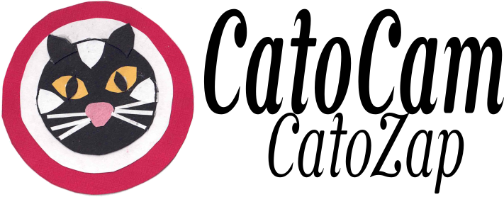

CatoCam & CatoZap - monitor a cctv camera to detect cats (CatoCam), and unleash a suitable cat deterrent (CatoZap).

Purpose
=======
The purpose of CatoCam/CatoZap is to deter cats from regarding our garden as their territory humanely.   We do not appreciate what they leave behind!

Project Outline
===============
There are two distinct parts to the project - CatoCam and CatoZap

Catocam monitors the video stream from a [Tp-Link tapo](https://www.tp-link.com/uk/home-networking/cloud-camera/tapo-c510w/) cctv camera by connecting to its local network rtsp stream to grab frames.  
 

It uses a machine learning object detection model [YoloV8](https://yolov8.com) to determine whether the frame contains an image of a cat or not.

It provides a web interface which can be monitored to see when a cat is detected.

CatoZap monitors the output of CatoCam to see when a cat enters the garden.  It then tries to deter the cat from remaining in the garden.   It is likely to do this using a water spray, but I might try an ultrasonic deterrent as done in this [similar project](https://medium.com/@james.milward/deterring-foxes-and-badgers-with-tensorflow-lite-python-raspberry-pi-ring-cameras-ultrasonic-75b3160faa3c).

CatoCam Structure
=================
  - Connect to the camera rtsp stream using the [framegrab](https://pypi.org/project/framegrab/) library
  - Grab a frame
  - Detect cats in the frame using a custom trained [YoloV8](https://yolov8.com) model (see below).
  - Save annotated frames that contain detected cats, birds or humans to disk for future analysis
  - Provide a simple web interface using the [Flask](https://pypi.org/project/Flask/) framework, which has the following functions:
      - View current image on web browser.
      - Browse through previous images where cats, birds or humans were detected.
      - Provide a simple status JSON object with detection status that can be monitored by CatoZap
  - It is configured using a simple JSON config.json file that specifies the camera parameters to access the video stream, and the object detection model to be used (see the example [config.json template](./config_template.json))

  Catocam is running on a Raspberry Pi 4B, 2GB memory and achieving 0.6 frames per second.  I am hoping to improve this by using a quantized version of the yolov8n model.

  An example output is shown below:
  

Training the YoloV8 Model
=========================
If found that pre-trained object detection models were giving poor performance on my cctv images, probably for two reasons:
  1 The camera angle is looking down on the  scene, which is not the case for most image libraries.
  2 The images are often taken under infrared illumination so are grey scale not colour

For this reason I modified the YoloV8 model by training it on my own models.   This required the following:
  - Set up the camera and have it monitor the garden, recording video clips when motion was detected.
  - View the video clips to identify which ones contain cats, and download them (You actually have to download the videos onto a phone as there is no computer interfae to the Tapo camera, only and Android App.  So the process was to view the video on my phone, download it onto my phone, and upload it to Google Photos.  I could then download it onto my computer using the Google Photos web site).
  - Use the [RoboFlow](https://roboflow.com) web site to create an annotated dataset by using its capabilities to:
      - split the video clips into frames
      - view each frame
      - let me draw a bounding box around the interesting objects (cats, birds or humans), and label them as such.
      - Add the images to a dataset, along with augmentation of the objects in the bounding boxes.
      - Publish the [dataset](https://app.roboflow.com/graham-jones-yynmh/catocam/8)
  - The annotation was made less tedious by first doing a few (well a hundred or so) frames manually, then using RoboFlow's training functionality (you get three goes at training a model with a free account), to create an object detection model.   This object detection model can then be used to help you annotate other images by suggesting what the bounding box and object is, so you only have to correct it when it has something wrong.
  - Export the Roboflow dataset in YoloV8 format
  - Use the simple [trainYolo.py](./yolo/trainYolo.py) script to train the model using our new dataset.
      - This creates a new set of weights for the yolo model, which we saved as [catFinderV8_yoloWeights.pt](./catFinderV8_yoloWeights.pt) for use by CatoCam.

